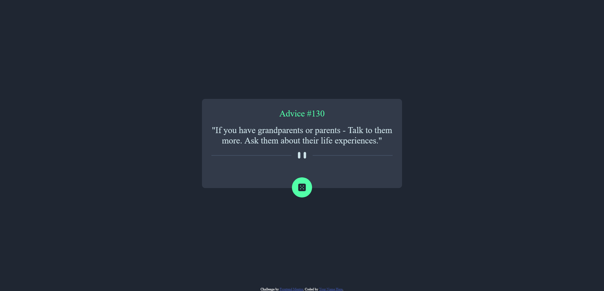

# Frontend Mentor - Advice generator app solution

This is a solution to the [Advice generator app challenge on Frontend Mentor](https://www.frontendmentor.io/challenges/advice-generator-app-QdUG-13db). Frontend Mentor challenges help you improve your coding skills by building realistic projects.

## Table of contents

- [Overview](#overview)
  - [The challenge](#the-challenge)
  - [Screenshot](#screenshot)
  - [Links](#links)
- [My process](#my-process)
  - [Built with](#built-with)
  - [What I learned](#what-i-learned)
  - [Useful resources](#useful-resources)
- [Acknowledgments](#acknowledgments)

## Overview

### The challenge

Users should be able to:

- Check on the dice image to load an advice.
- API will need a 2 second pause. 

### Screenshot

### Links

- Live Site URL: [Live](https://antran1245.github.io/advice-generator-app-main/)

## My process

### Built with

- Semantic HTML5 markup
- CSS custom properties
- Flexbox
- Mobile-first workflow

### What I learned

- I learned how to use fetch to get data from an API, then inputing the data onto HTML. 

### Useful resources

- [Advice Slip API](https://api.adviceslip.com/) 

## Acknowledgments
